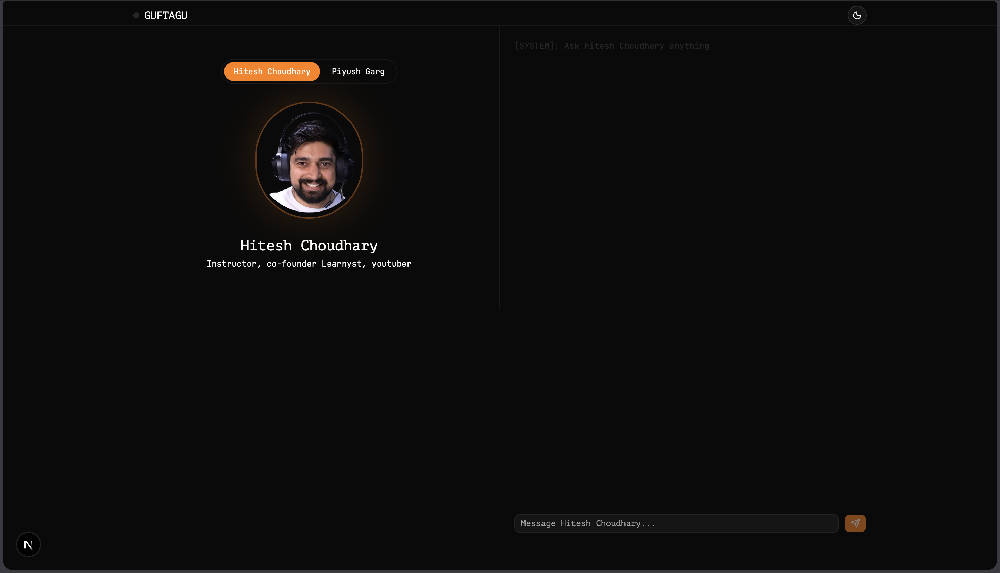
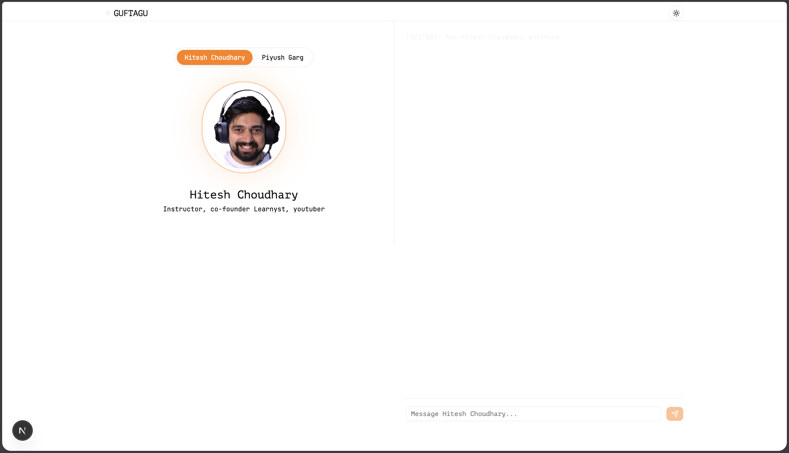
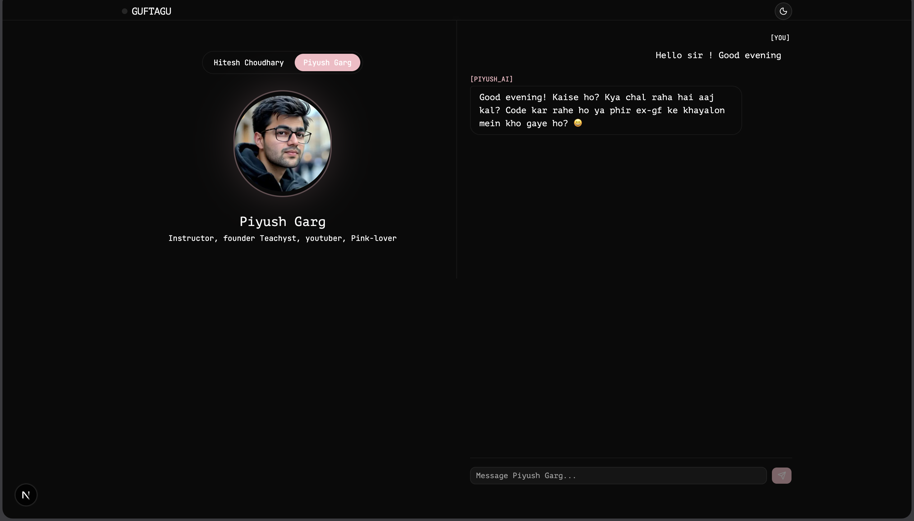
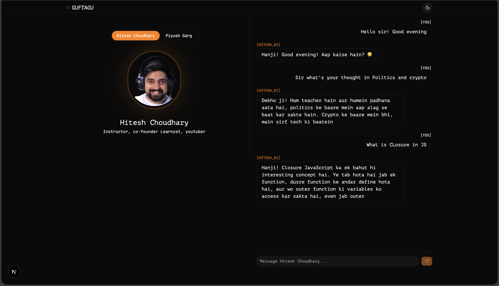

# Guftagu — Chat with an AI Playing a Character

An AI chatbot that role-plays as different personas (currently: Hitesh Choudhary, Piyush Garg — swap in your own by editing one file). Built to practice full-stack skills: Node.js/Express backend, Next.js + Tailwind + shadcn/ui frontend, and prompt engineering for consistent persona behavior.



---

## Table of Contents

- [Features](#features)
- [Tech Stack](#tech-stack)
- [Project Structure](#project-structure)
- [Prerequisites](#prerequisites)
- [Setup](#setup)
    - [1. Clone the repo](#1-clone-the-repo)
    - [2. Backend setup](#2-backend-setup)
    - [3. Frontend setup](#3-frontend-setup)
    - [4. Run both](#4-run-both)
- [Environment Variables](#environment-variables)
- [API Reference](#api-reference)
- [Adding a New Persona](#adding-a-new-persona)
- [Screenshots](#screenshots)
- [Known Limitations](#known-limitations)
- [Roadmap](#roadmap)
- [License](#license)

---

## Features

- 🎭 Multiple personas, switchable in one click — each with its own tone and style
- 💬 Per-persona chat history (switching personas doesn't mix or lose conversations)
- 💾 Chat history persisted in `localStorage` — survives page refresh
- 🌗 Light/dark theme toggle
- ⚡ Node.js + Express backend proxying OpenAI, so the API key never touches the browser
- 🎨 Distinct visual identity per persona (avatar glow, toggle color, message tags)

<!--
  PASTE A SHORT DEMO GIF HERE showing persona switching + a live reply.
  Example: 
-->

---

## Tech Stack

**Frontend**

- Next.js (App Router)
- Tailwind CSS
- shadcn/ui
- next-themes (theme toggle)
- lucide-react (icons)

**Backend**

- Node.js + Express
- OpenAI SDK (`openai` npm package)
- dotenv, cors

---

## Project Structure

```
persona-ai/
├── backend/
│   ├── src/
│   │   ├── routes/
│   │   │   └── chat.routes.js       # POST /api/chat
│   │   ├── services/
│   │   │   └── chat.service.js      # OpenAI call logic
│   │   └── personas/
│   │       ├── index.js             # personaId -> config registry
│   │       ├── HiteshChoudhary.js
│   │       └── PiyushGarg.js
│   ├── server.js
│   ├── .env                          # not committed
│   └── package.json
│
└── frontend/
    ├── app/
    │   ├── layout.tsx
    │   ├── page.tsx
    │   └── globals.css
    ├── components/
    │   ├── navbar.tsx
    │   ├── theme-toggle.tsx
    │   ├── persona-toggle.tsx
    │   ├── avatar-panel.tsx
    │   ├── chat-panel.tsx
    │   └── ui/                       # shadcn components
    ├── lib/
    │   └── personas.ts               # persona metadata (name, accent, avatar)
    ├── public/
    │   └── avatars/                  # persona avatar images go here
    ├── tailwind.config.ts
    └── package.json
```

---

## Prerequisites

- Node.js v18 or higher
- npm (or pnpm/yarn if you prefer — adjust commands accordingly)
- An OpenAI API key ([platform.openai.com](https://platform.openai.com))

---

## Setup

### 1. Clone the repo

```bash
git clone <your-repo-url>
cd persona-ai
```

### 2. Backend setup

```bash
cd backend
npm install
```

Create a `.env` file in `backend/`:

```
OPENAI_API_KEY=your_openai_api_key_here
PORT=8080
```

Run the backend:

```bash
node server.js
```

Test it's alive before touching the frontend:

```bash
curl -X POST http://localhost:8080/api/chat \
  -H "Content-Type: application/json" \
  -d "{\"message\":\"Hello\",\"personaId\":\"hitesh\",\"history\":[]}"
```

You should get back `{ "reply": "..." }`.

### 3. Frontend setup

```bash
cd frontend
npm install
```

Add persona avatar images (optional — falls back to initials if missing):

```
public/avatars/hitesh.png
public/avatars/piyush.png
```

Run the frontend:

```bash
npm run dev
```

Open [http://localhost:3000](http://localhost:3000).

### 4. Run both

Two terminals, both running at the same time:

```bash
# terminal 1
cd backend && node server.js

# terminal 2
cd frontend && npm run dev
```

---

## Environment Variables

| Variable         | Location | Description                                              |
| ---------------- | -------- | -------------------------------------------------------- |
| `OPENAI_API_KEY` | backend  | Your OpenAI API key. Never expose this in frontend code. |
| `PORT`           | backend  | Port the Express server runs on (default: 8080)          |

---

## API Reference

### `POST /api/chat`

**Request body:**

```json
{
    "message": "What's your advice for beginners?",
    "personaId": "hitesh",
    "history": [
        { "role": "user", "content": "Hello" },
        { "role": "assistant", "content": "Hanji! Kaise hai aap!" }
    ]
}
```

**Success response — `200`:**

```json
{ "reply": "Hanji! Ek chhota project uthao, consistency rakho..." }
```

**Error responses:**

| Status | Reason                         |
| ------ | ------------------------------ |
| 400    | `message` missing/empty        |
| 400    | `personaId` missing or unknown |
| 500    | Unexpected server/OpenAI error |

---

## Adding a New Persona

1. Create a new file in `backend/src/personas/`, e.g. `NewPersona.js`, following the same shape as `HiteshChoudhary.js` (id, name, systemPrompt, maxTokens, temperature).
2. Register it in `backend/src/personas/index.js`.
3. Add a matching entry in `frontend/lib/personas.ts` (same `id`, plus display name, accent color, avatar path).
4. Drop an avatar image at `frontend/public/avatars/<id>.png`.

No other files need to change — persona switching in the UI and routing on the backend both key off `personaId`.

---

## Screenshots

<!--
  PASTE UI SCREENSHOTS BELOW AS PROOF OF WORK.
  Suggested set:
    1. Light mode, empty chat
    2. Dark mode, empty chat
    3. Active conversation with persona A
    4. Active conversation with persona B (showing accent color change)
    5. Mobile/responsive view
-->

**Light mode**



**Dark mode**


**Persona switching**



**Conversation in progress**



---

## Known Limitations

- No authentication — chat history is per-browser (`localStorage`), not per-user account
- No database — clearing browser storage clears all history
- No streaming — replies arrive as a single block, not token-by-token
- No rate limiting on the backend — don't expose this publicly without adding some

---

<!-- ## Roadmap

- [ ] Streaming responses (token-by-token)
- [ ] Persist history in a real database instead of localStorage
- [ ] Basic auth for per-user history
- [ ] Rate limiting per user/IP
- [ ] Deploy backend (Render) + frontend (Vercel)

--- -->

## License

MIT — do whatever you want with it, no warranty.
